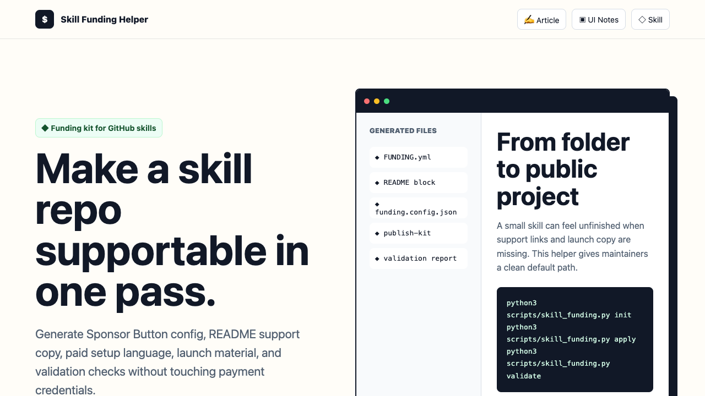
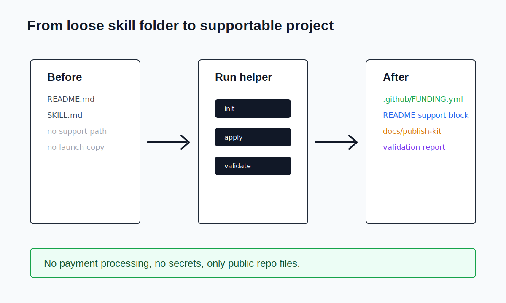

# Skill Funding Helper

Turn a GitHub-hosted skill into a small open source product with a clear support path.



Skill Funding Helper helps maintainers add sponsor, donation, and paid support entry points to Claude Code, Codex, OpenClaw, and other agent skill repositories. It does not process payments or store tokens. It generates the public files that GitHub and readers expect to see.

## Why this exists

Good skills are becoming reusable work products. They encode workflows, judgment, templates, and repeated operating knowledge. But many skill repositories stop at `SKILL.md`, with no funding link, no support path, and no launch copy.

This project gives maintainers a repeatable publishing kit.

## What it generates

- `.github/FUNDING.yml` for GitHub Sponsor Button support
- A README sponsor block that can be inserted safely
- A `funding.config.json` starter file
- A launch kit for GitHub, X, LinkedIn, and WeChat
- A validator for skill metadata and funding config hygiene

## Supported platforms

GitHub Sponsors, Patreon, Open Collective, Ko-fi, Buy Me a Coffee, Liberapay, IssueHunt, thanks.dev, Tidelift, Polar, and custom URLs.

## Quick start

```bash
python3 scripts/skill_funding.py init --repo-root . --project-name "My Useful Skill" --github your-github-user
python3 scripts/skill_funding.py apply --repo-root . --config funding.config.json --update-readme --publish-kit
python3 scripts/skill_funding.py validate --repo-root .
```

## Repository layout

```text
skills/skill-funding-helper/SKILL.md
.claude/skills/skill-funding-helper/SKILL.md
.agents/skills/skill-funding-helper/SKILL.md
scripts/skill_funding.py
templates/README.sponsor-block.md
examples/basic/funding.config.json
docs/wechat-article.md
docs/ui-redesign-notes.md
index.html
assets/
```

The repeated skill paths make the project easier to copy into different agent ecosystems.

## Visual redesign

The project page has been redesigned around three user decisions instead of a generic landing page.



The first screen explains the value, the center of the page shows the generated files, and the lower sections show how the publishing kit travels from local config to GitHub Sponsor Button to public launch copy.

## Safe boundaries

Skill Funding Helper does not collect money, authenticate with payment providers, or write secret tokens. It only writes public repository files from a local config.

That boundary is deliberate. A funding helper should make support visible and maintainable, not become a payment processor.

## Sponsor block markers

When `--update-readme` is enabled, the script writes between these markers:

```md
<!-- skill-funding-helper:start -->
<!-- skill-funding-helper:end -->
```

This makes repeated runs idempotent and keeps the rest of your README untouched.

## Docs

- [公众号文章](docs/wechat-article.md)
- [UI redesign notes](docs/ui-redesign-notes.md)
- [Launch checklist](docs/launch-checklist.md)
- [Quality report](docs/quality-report.md)

## License

MIT

