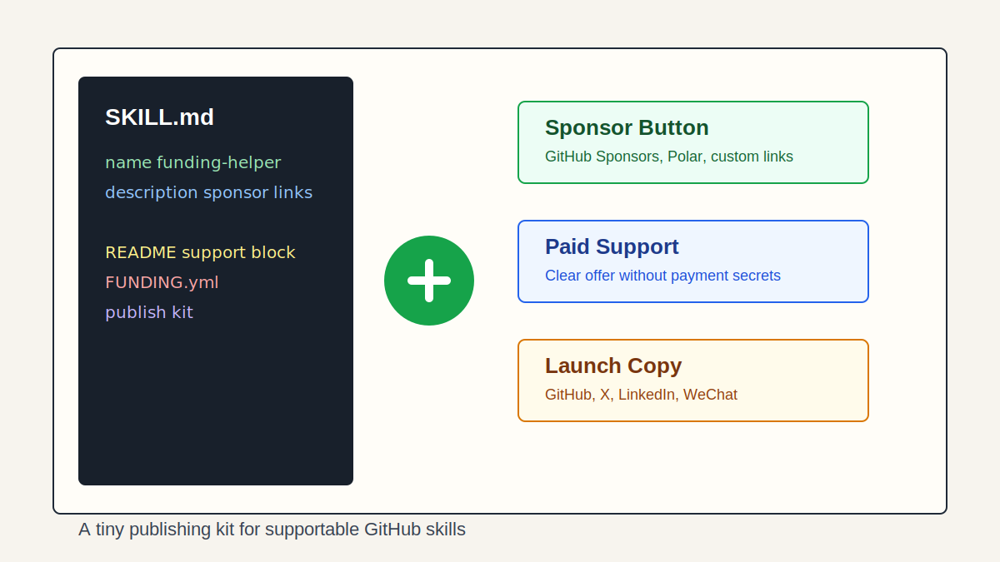
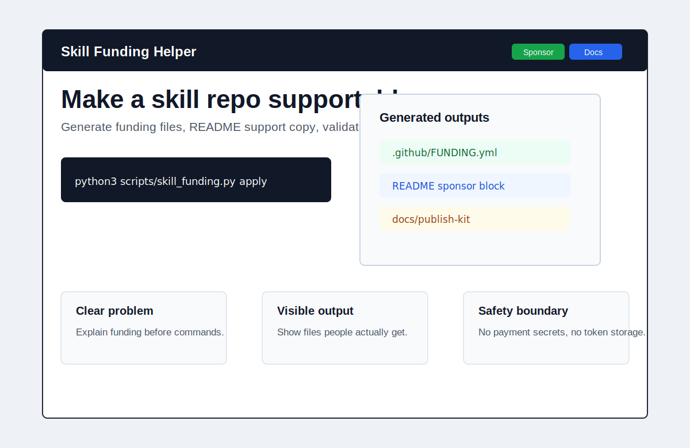
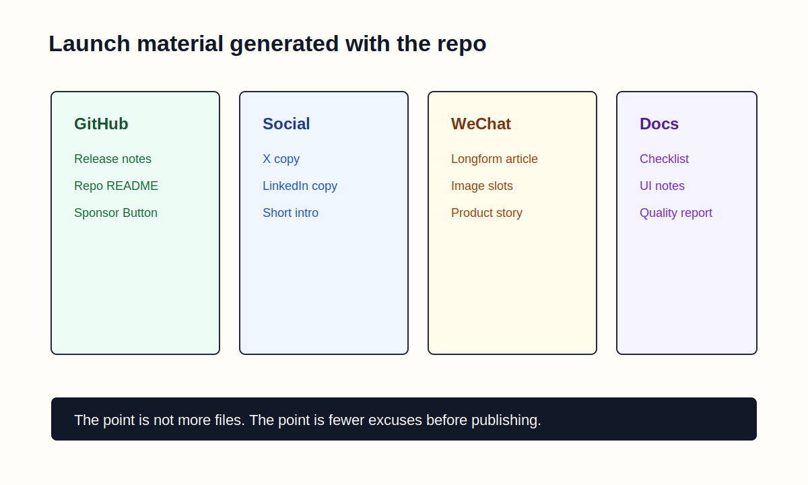

# 我写了一个小技能，专门帮 GitHub 上的 Skill 接上打赏入口

故事是这样的。

我前两天在想一个问题。

如果以后大家真的开始大量写 Skill，那这些 Skill 最后会变成什么东西？

不是那种宏大的，未来十年 Agent 生态会怎样。

就很具体。

你今天写了一个 `SKILL.md`。

它能帮别人整理合同，检查投标文件，生成外贸跟进邮件，复盘 GitHub issue，或者把一个特别烦的工作流程变成标准动作。

然后别人 Star 了。

Fork 了。

甚至真的用了。

然后呢？

我当时就卡在这个然后呢上面了。。。



说实话，很多 Skill 仓库现在看起来都还挺原始的。

一个 README。

一个 `SKILL.md`。

运气好一点，有几个 example。

运气差一点，README 里只有一句，copy this folder。

这当然没问题。

毕竟这个生态才刚开始，大家还在摸索，愚钝如我也是边写边试，很多东西都没完全跑通。

但我一直觉得，一个东西只要开始被别人重复使用，它就会慢慢长出产品的形状。

代码库是这样。

npm 包是这样。

VS Code 插件是这样。

现在轮到 Skill 了。

你想想看，一个 Skill 和一段 Prompt 最大的区别是什么？

Prompt 更像一句咒语。

Skill 更像一套手艺。

它里面不只是文本，而是一个人怎么判断问题，怎么拆流程，怎么避坑，怎么把重复动作变成可执行步骤。

这玩意一旦好用，就不只是好玩了。

它会真的省时间。

而能省时间的东西，就会遇到一个很现实的问题。

维护者怎么继续维护？


坦率的讲，我不是想把所有 Skill 都搞成收费软件。

不是说开源不行。

也不是说每个 README 都应该挂一个巨大的付款按钮。

我非常理解很多人的反感。

你就是想分享一个小工具，突然有人冲上来跟你讲商业闭环，增长飞轮，私域转化，听着就头疼。

我也头疼。

但另一边也确实存在。

一个四五线城市的小团队，可能真的靠你写的投标检查 Skill 少踩了一个坑。

一个刚毕业的运营，可能真的靠你写的邮件复盘 Skill，把一堆乱七八糟的客户跟进整理清楚。

一个独立开发者，可能真的靠你写的 GitHub 发布 Skill，把项目从一个文件夹，整理成了一个像样的开源仓库。

他未必会付费。

但如果他愿意请你喝杯咖啡，或者公司愿意买一次付费部署，这事儿不丢人。

入口清楚，边界清楚，就挺好。

所以我做了一个小东西。

`Skill Funding Helper`。

名字很直。

甚至有点土。

但我还挺喜欢这种土的，它一眼就能看懂。

这玩意就是帮 GitHub 上的 Skill 仓库，加上打赏，赞助，付费支持入口。

它不做支付。

不碰密码。

不存 token。

不帮你伪装成什么官方项目。

它只做几件非常具体的事。

生成 `.github/FUNDING.yml`。

给 README 插入一个支持区块。

生成 `funding.config.json`。

检查 `SKILL.md` 有没有基本的 frontmatter。

顺手产出一套 GitHub Release，X，LinkedIn，公众号可以改一改就发的发布文案。

我跟你说，这里面最让我觉得有意思的，不是生成文件。

生成文件有什么难的。

真正有意思的是，它强迫你把一个 Skill 当成一个可以被支持的小型开源产品。



回到 Skill 这块。

现在大家写 Skill，经常还是 Prompt 思维。

我有一个好用的提示词，我包一下，放进去。

但如果你把它当成开源项目，思路就会不一样。

你会开始问自己，这个 Skill 到底帮谁解决问题？

用户第一次打开仓库，能不能在 10 秒内知道怎么用？

它有没有示例？

有没有安全边界？

如果别人用爽了，想支持一下，入口在哪里？

如果企业用户想找你定制，怎么联系？

这些问题都很琐碎。

但开源项目的质感，很多时候就是这些琐碎东西堆出来的。

我突然想到了早年的开源包生态。

最开始大家就是把代码扔上去。

能跑就行。

后来慢慢开始有 README，有 changelog，有 issue template，有 CI，有 release note，有 sponsor button。

不是因为大家突然都变得很仪式化。

而是因为一个项目一旦被很多陌生人使用，就需要这些东西来降低信任成本。

Skill 也会走这条路。

只是它开源的不是函数，不是组件，不是框架。

它开源的是工作方法。

是判断标准。

是一个人长期踩坑之后总结出来的流程。

大时代啊，朋友们。

这个项目里我做了几个 UI 上的小调整。

之前的版本更像一个脚本仓库。

能用，但传播感弱。

这次我把它重新设计成三个层次。

第一眼先告诉你，它解决的是 Skill 仓库的支持入口问题。

第二眼直接给你看，它会生成哪些文件。

第三眼再解释安全边界和发布路径。

这块我觉得挺重要。

很多开源项目的问题不是不好用，而是别人看不懂你到底想让他干嘛。

尤其是这种偏基础设施的小工具。

你如果一上来就丢一堆命令，很多人会跑。

但你先给他一个画面。

你的仓库原来是散的。

跑完之后，有 FUNDING，有 README 支持区，有发布文案，有校验。

他脑子里一下就有结果了。

这就是效果图要做的事。

不是装饰。

是降低理解成本。



使用方式也尽量压到很短。

初始化配置。

```bash
python3 scripts/skill_funding.py init --repo-root . --project-name 'My Useful Skill' --github your-github-user
```

生成资金入口和发布资料。

```bash
python3 scripts/skill_funding.py apply --repo-root . --config funding.config.json --update-readme --publish-kit
```

检查仓库。

```bash
python3 scripts/skill_funding.py validate --repo-root .
```

就三步。

我知道，真实世界里肯定还会有各种边角问题。

比如不同平台的用户名格式。

比如 README 原来就有 sponsor 区块。

比如有的人不想用 GitHub Sponsors，只想放一个自定义链接。

比如团队版的 paid support 应该怎么写才不油腻。

这些东西都可以慢慢补。

但最小闭环已经在这里了。

而且我给它加了一个我自己很在意的边界。

安全，安全，还是安全。

AI Agent 的 Skill 一旦能读写文件，用户会天然有一点紧张。

所以这个项目从设计上就不碰敏感信息。

不问你密码。

不问你付款密钥。

不问你银行信息。

所有生成的东西，都应该是可以公开放进 GitHub 仓库的内容。

这条线必须画清楚。

不是哥们，打赏入口这种东西，要是最后搞成让用户把 token 填进 config，那就真的有点离谱了。

顺着上面的再聊聊传播。

我现在越来越觉得，小型开源 Skill 想传播，不能只靠功能。

功能当然重要。

但功能只是让用户觉得有用。

传播需要让用户觉得，我可以立刻转发给某个朋友。

所以这次我给仓库加了 `docs/publish-kit`。

你跑完命令之后，它会顺手生成 GitHub Release 文案，社交平台文案，还有公众号文章素材。

这东西听起来有点小题大做。

但你相信我，很多项目最后没有被发出去，不是因为代码没写完。

是因为发布那一刻，人懒了。

不知道怎么介绍。

不知道标题怎么写。

不知道第一段怎么开。

然后项目就躺在本地文件夹里，慢慢变成一种精神负债。

我自己也经常这样。

写完了。

验证了。

然后发布文案卡住。

最后想想，算了明天再说。

明天就没有明天了。

所以我干脆把发布文案也变成生成物。

这不高级。

但很实用。

我有时候觉得，Agent 时代最有价值的 Skill，不一定是那种看起来很酷炫的。

反而是这种小而硬的。

给 Skill 仓库加赞助入口。

给投标文件做合规检查。

给外贸邮件生成跟进策略。

给报价单做风险复盘。

给 GitHub issue 自动拆修复计划。

给团队知识库生成 SOP。

每个都很窄。

但每个都能把一个重复动作，从模糊，变成清楚。

这就是 Skill 的价值。

你把一个人的经验，变成 Agent 可以调用的能力。

然后把这个能力放到 GitHub 上，让别人复制，修改，Star，Fork，甚至付费支持。

听着很小。

但我是真的觉得，这里面有新的开源味道。

以前我们开源的是代码仓库。

后来我们开源模板，工作流，自动化脚本。

现在，我们开始开源能力仓库。

能力仓库。

这个词我越想越喜欢。

一个好 Skill 不是一段文本。

它更像一小块可移植的经验。

而经验如果真的持续帮到别人，它就应该有一个体面的支持入口。

这就是我写 Skill Funding Helper 的原因。

不是为了把开源搞得满身铜臭。

而是让那些真的有用的小东西，有机会被继续维护。

哪怕只是多一点点动力。

多一点点反馈。

多一个人说，这玩意帮到我了。

那也挺好。

以上，既然看到这里了，如果觉得不错，随手点个赞、在看、转发三连吧，如果想第一时间收到推送，也可以给我个星标⭐～

谢谢你看我的文章，我们，下次再见。

> / 作者，寸言
> / 联系我，私信我
